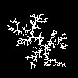

# DLA-cpp

This is an example of Diffusion-limited aggregation, a process proposed in 1981 by T.A. Witten Jr. and L.M. Sander.

Essentially, one pixel is placed in the center of the image, and then the following pixels are randomly placed in the image and are moved by increments of 1 in a random direction untill they find themselves next to a current pixel.

This allows for the generation of clusters which reflect some real world depositing behaviors and which can be used for various different applications, such as random heightmap generation for fairly realistic looking mountains.

